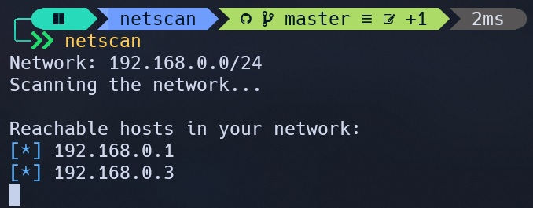
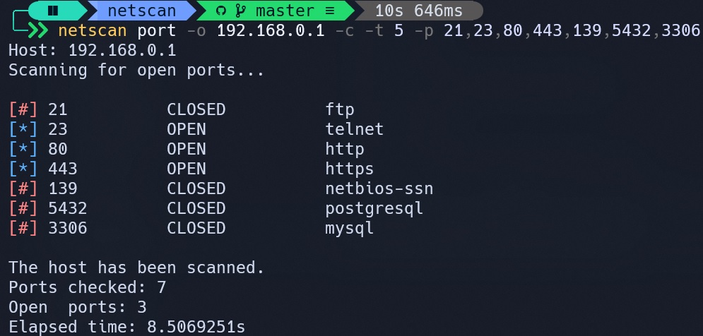

# 🕸️ netscan

A CLI tool to scan your network.  
This tool is written in Golang and uses [Cobra](https://github.com/spf13/cobra).





<hr />

## Installation
- Step 0: Download Git and Go.
- Step 1: Open a terminal and type these commands:
  ```sh
  # clone the repository
  git clone https://github.com/0l1v3rr/netscan.git
  cd netscan

  # build the executable
  # the executable should be placed inside the bin/ folder
  make build
  ```
- Step 2: Set the `bin/` folder as an environment variable or an alias. This is OS specific. This allows you to use the command everywhere.

<hr />

## Usage
Using the tool is very simple, just enter the `netscan` command.  
The tool has more functions, to show them, enter the `netscan help` command.

<hr />

## License
The project is licensed under the [MIT License](LICENSE).